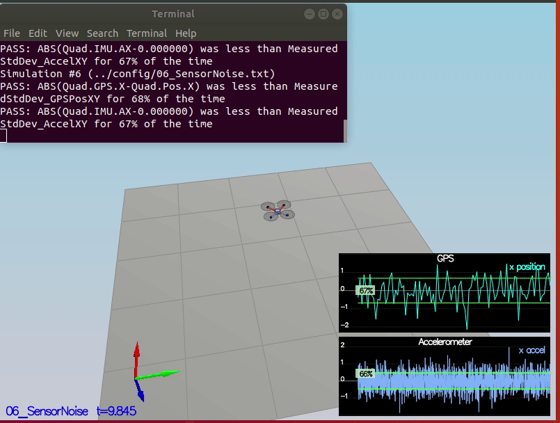
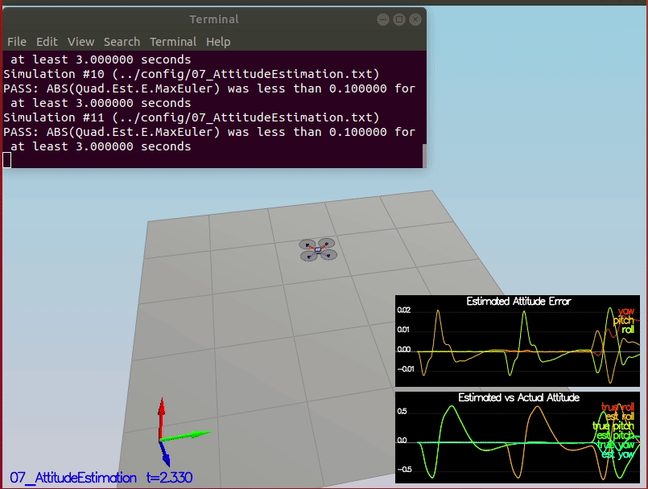
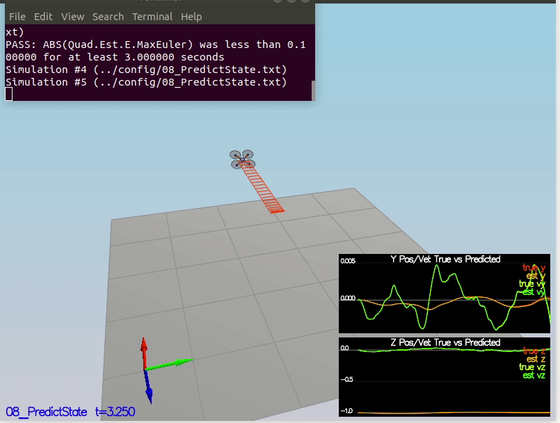
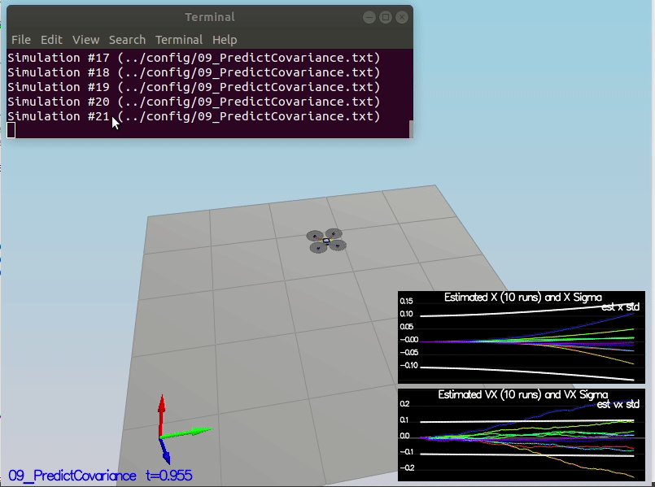
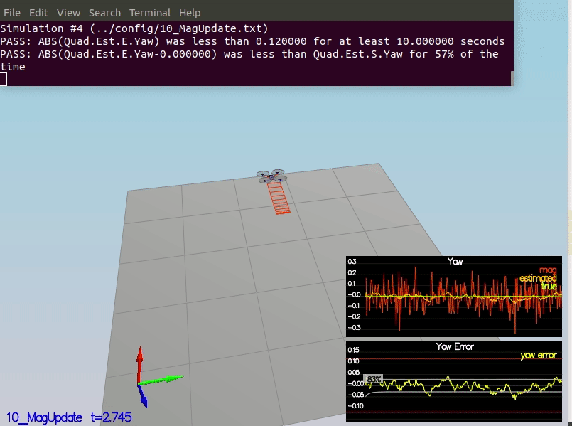
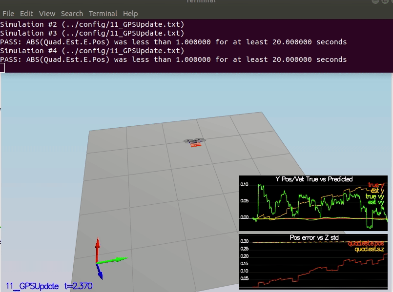
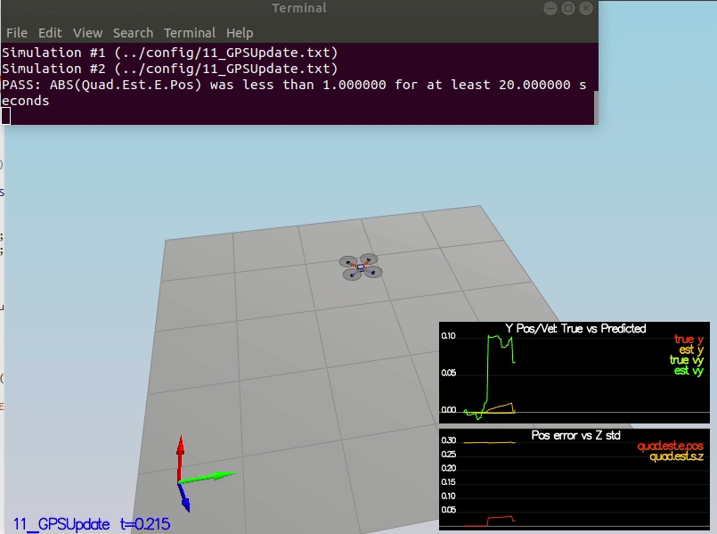

<div style="text-align: center">
  
</div>

# Build an estimator Project


1. [Introduction](#introduction)
2. [Step 1: Sensor noise](#noise)
3. [Step 2: Altitude Estimation](#altitude)
4. [Step 3: Prediction Step](#prediction)
5. [Step 4: Magnetometer Update](#magnetometer)
6. [Step 5: Closed Loop + GPS Update](#closed)
7. [Step 6: Adding your Controller](#controller)

<a name=introduction />

## 1. Introduction

Welcome to the estimation project. In this project, you will be developing the estimation portion of the controller used in the $CPP$ simulator. By the end of the project, your simulated quad will be flying with your estimator and your custom controller.

<a name=noise />

## 2. Step 1: Sensor noise

For the controls project, the simulator was working with a perfect set of sensors, meaning none of the sensors had any noise. The first step to adding additional realism to the problem, and developing an estimator, is adding noise to the quad's sensors. For the first step, you will collect some simulated noisy sensor data and estimate the standard deviation of the quad's sensor.

### Scenario

```shell
06_NoisySensors
```


### Implementation

#### config/06_SensorNoise.txt

```shell
### STUDENT SECTION

MeasuredStdDev_GPSPosXY = 0.6797007868796459
MeasuredStdDev_AccelXY = 0.475746035407147

### END STUDENT SECTION
```

### Success criteria

```shell
Your standard deviations should accurately capture the value of approximately 68% of the respective measurements.
```

### Result

<div style="text-align: center">
  
</div>


<a name=altitude />

## 3. Step 2: Altitude estimator

Now let's look at the first step to our state estimation: including information from our IMU. In this step, you will be improving the complementary filter-type attitude filter with a better rate gyro attitude integration scheme.

### Scenario

```shell
06_NoisySensors
```

### Implementation

Using the following equation to obtain the Euler angles.
$$
\begin{bmatrix}
\dot \phi \\
\dot \theta \\
\dot \psi 
\end{bmatrix} = 
\begin{bmatrix}
1 & \sin \phi \tan \theta & \cos \phi \tan \theta \\
0 & \cos \phi & -\sin \phi  \\
0 & \sin \phi \sec \theta & \cos \phi \sec \theta 
\end{bmatrix} \times 
\begin{bmatrix}
p \\
q \\
r \\
\end{bmatrix}
$$


#### src/QuadEstimatorEKF.cpp

```c++
void QuadEstimatorEKF::UpdateFromIMU(V3F accel, V3F gyro)
{
  // Improve a complementary filter-type attitude filter
  // 
  // Currently a small-angle approximation integration method is implemented
  // The integrated (predicted) value is then updated in a complementary filter style with attitude information from accelerometers
  // 
  // Implement a better integration method that uses the current attitude estimate (rollEst, pitchEst and ekfState(6))
  // to integrate the body rates into new Euler angles.
  //
  // HINTS:
  //  - there are several ways to go about this, including:
  //    1) create a rotation matrix based on your current Euler angles, integrate that, convert back to Euler angles
  //    OR 
  //    2) use the Quaternion<float> class, which has a handy FromEuler123_RPY function for creating a quaternion from Euler Roll/PitchYaw
  //       (Quaternion<float> also has a IntegrateBodyRate function, though this uses quaternions, not Euler angles)

  ////////////////////////////// BEGIN STUDENT CODE ///////////////////////////
  // SMALL ANGLE GYRO INTEGRATION:
  // (replace the code below)
  // make sure you comment it out when you add your own code -- otherwise e.g. you might integrate yaw twice

   float phi = rollEst;
   float theta = pitchEst;

   // Rotatin Matrix (Equation 1)
   Mat3x3F R = Mat3x3F();
   R(0,0) = 1;
   R(0,1) = sin(phi) * tan(theta);
   R(0,2) = cos(phi) * tan(theta);
   R(1,0) = 0;
   R(1,1) = cos(phi);
   R(1,2) = -sin(phi);
   R(2,0) = 0;
   R(2,1) = sin(phi) / cos(theta);  
   R(2,2) = cos(phi) / cos(theta); 

   V3F euler_dot = R * gyro ;

   // Predict
   float predictedPitch = pitchEst + dtIMU * euler_dot.y;
   float predictedRoll = rollEst + dtIMU * euler_dot.x;
   ekfState(6) = ekfState(6) + dtIMU * euler_dot.z;	

   // normalize yaw to -pi .. pi
   if (ekfState(6) > F_PI) ekfState(6) -= 2.f*F_PI;
   if (ekfState(6) < -F_PI) ekfState(6) += 2.f*F_PI;

  /////////////////////////////// END STUDENT CODE ////////////////////////////

  // Update
  accelRoll = atan2f(accel.y, accel.z);
  accelPitch = atan2f(-accel.x, 9.81f);

  // FUSE INTEGRATION AND UPDATE
  rollEst = attitudeTau / (attitudeTau + dtIMU) * (predictedRoll)+dtIMU / (attitudeTau + dtIMU) * accelRoll;
  pitchEst = attitudeTau / (attitudeTau + dtIMU) * (predictedPitch)+dtIMU / (attitudeTau + dtIMU) * accelPitch;

  lastGyro = gyro;
}
```

### Success criteria

```shell
Your attitude estimator needs to get within 0.1 rad for each of the Euler angles for at least 3 seconds.
```

### Result

<div style="text-align: center">
  
</div>

<a name=prediction />

## 4. Step 3: Prediction step

In this next step you will be implementing the prediction step of your filter.

### Scenario 1

```shell
08_PredictState
```

#### Implementation

##### src/QuadEstimatorEKF.cpp

```c++
VectorXf QuadEstimatorEKF::PredictState(VectorXf curState, float dt, V3F accel, V3F gyro)
{
  assert(curState.size() == QUAD_EKF_NUM_STATES);
  VectorXf predictedState = curState;
  // Predict the current state forward by time dt using current accelerations and body rates as input
  // INPUTS: 
  //   curState: starting state
  //   dt: time step to predict forward by [s]
  //   accel: acceleration of the vehicle, in body frame, *not including gravity* [m/s2]
  //   gyro: body rates of the vehicle, in body frame [rad/s]
  //   
  // OUTPUT:
  //   return the predicted state as a vector

  // HINTS 
  // - dt is the time duration for which you should predict. It will be very short (on the order of 1ms)
  //   so simplistic integration methods are fine here
  // - we've created an Attitude Quaternion for you from the current state. Use 
  //   attitude.Rotate_BtoI(<V3F>) to rotate a vector from body frame to inertial frame
  // - the yaw integral is already done in the IMU update. Be sure not to integrate it again here

  Quaternion<float> attitude = Quaternion<float>::FromEuler123_RPY(rollEst, pitchEst, curState(6));

  ////////////////////////////// BEGIN STUDENT CODE ///////////////////////////

  //Dead Reckoning
  predictedState(0) = curState(0) + curState(3) * dt; // x coordianate x= x + \dot{x} * dt
  predictedState(1) = curState(1) + curState(4) * dt; // y coordianate y= y + \dot{y} * dt
  predictedState(2) = curState(2) + curState(5) * dt; // z coordianate z= z + \dot{z} * dt

  //Convert the body frame acceleration measurements back to the inertial frame 	  measurements
  V3F acc_inertial = attitude.Rotate_BtoI(accel);

  predictedState(3) = curState(3) + acc_inertial.x * dt; // change in velocity along the x is a_x * dt
  predictedState(4) = curState(4) + acc_inertial.y * dt; // change in velocity along the y is a_y * dt
  predictedState(5) = curState(5) + acc_inertial.z * dt - CONST_GRAVITY * dt; // change in velocity along the z is a_z * dt by removing the gravity component

  /////////////////////////////// END STUDENT CODE ////////////////////////////

  return predictedState;
}
```


#### Success criteria

```shell
This step doesn't have any specific measurable criteria being checked.
```

#### Result

<div style="text-align: center">
  
</div>


### Scenario 2

```shell
09_PredictionCov
```

#### Implementation

Calculating the partial derivative of the body to global rotation matrix.
$$
\begin{align}
R'_{bg} = \left[
  \begin{array}{ccc}
    -\cos \theta \sin \psi&
    -\sin\phi \sin \theta \sin \psi - \cos \phi \cos \psi&
    -cos \phi \sin \theta \sin \psi + \sin \phi \cos \psi\\
    \cos \theta \cos \psi&
    \sin \phi \sin \theta \cos \psi - \cos \phi \sin \psi&
    \cos \phi \sin \theta \cos \psi + \sin \phi \sin \psi\\
    0&0&0
  \end{array}
  \right]
\end{align}
$$


##### src/QuadEstimatorEKF.cpp

```c++
MatrixXf QuadEstimatorEKF::GetRbgPrime(float roll, float pitch, float yaw)
{
  // first, figure out the Rbg_prime
  MatrixXf RbgPrime(3, 3);
  RbgPrime.setZero();

  // Return the partial derivative of the Rbg rotation matrix with respect to yaw. We call this RbgPrime.
  // INPUTS: 
  //   roll, pitch, yaw: Euler angles at which to calculate RbgPrime
  //   
  // OUTPUT:
  //   return the 3x3 matrix representing the partial derivative at the given point

  // HINTS
  // - this is just a matter of putting the right sin() and cos() functions in the right place.
  //   make sure you write clear code and triple-check your math
  // - You can also do some numerical partial derivatives in a unit test scheme to check 
  //   that your calculations are reasonable

  ////////////////////////////// BEGIN STUDENT CODE ///////////////////////////
    
  // Equation (2)
  float theta = pitch;
  float phi = roll ;
  float psi = yaw ;

  RbgPrime(0,0) = (- ( cos(theta) * sin(psi) ) );
  RbgPrime(0,1) = (- ( sin(phi) * sin(theta) * sin(psi) ) - ( cos(phi) * cos(psi) ) );
  RbgPrime(0,2) = (- ( cos(phi) * sin(theta) * sin(psi) ) + ( sin(phi) * cos(psi) ) );

  RbgPrime(1,0) = ( cos(theta) * cos(psi) ) ;
  RbgPrime(1,1) = ( sin(phi) * sin(theta) * cos(psi) ) - ( cos(phi) * sin(psi) );
  RbgPrime(1,2) = ( cos(phi) * sin(theta) * cos(psi) ) + ( sin(phi) * sin(psi) );

  RbgPrime(2,0) = 0;
  RbgPrime(2,1) = 0;
  RbgPrime(2,2) = 0;


  /////////////////////////////// END STUDENT CODE ////////////////////////////

  return RbgPrime;
}
```


Obtaining the Jacobian Matrix and implementing prediction step.
$$
\begin{align}
  g'(x_t, u_t, \Delta t) &= \left [ \begin{array}{ccccccc}
      1 & 0 & 0 & \Delta t & 0 & 0 & 0\\
      0 & 1 & 0 & 0 & \Delta t & 0 & 0\\
      0 & 0 & 1 & 0 & 0 & \Delta t & 0\\
      0 & 0 & 0 & 1 & 0 & 0 & \frac{\partial}{\partial x_{t,\psi}} \left(x_{t,\dot{x}} + R_{bg}[0:]u_t[0:3] \Delta t\right)\\
      0 & 0 & 0 & 0 & 1  & 0 & \frac{\partial}{\partial x_{t,\psi}} \left(x_{t, \dot{y}} + R_{bg}[1:]u_t[0:3] \Delta t\right)\\
      0 & 0 & 0 & 0 & 0 & 1 & \frac{\partial}{\partial x_{t,\psi}} \left(x_{t, \dot{z}} + R_{bg}[2:]u_t[0:3] \Delta t\right)\\
      0 & 0 & 0 & 0 & 0 & 0 & 1\\ 
    \end{array}
    \right]\\
&= \left [ \begin{array}{ccccccc}
      1 & 0 & 0 & \Delta t & 0 & 0 & 0\\
      0 & 1 & 0 & 0 & \Delta t & 0 & 0\\
      0 & 0 & 1 & 0 & 0 & \Delta t & 0\\
      0 & 0 & 0 & 1 & 0 & 0 & R'_{bg}[0:]u_t[0:3] \Delta t\\
      0 & 0 & 0 & 0 & 1  & 0 & R'_{bg}[1:]u_t[0:3] \Delta t\\
      0 & 0 & 0 & 0 & 0 & 1 &  R'_{bg}[2:]u_t[0:3] \Delta t\\
      0 & 0 & 0 & 0 & 0 & 0 & 1
    \end{array}
    \right]
\end{align}
$$


```c++
void QuadEstimatorEKF::Predict(float dt, V3F accel, V3F gyro)
{
  // predict the state forward
  VectorXf newState = PredictState(ekfState, dt, accel, gyro);

  // Predict the current covariance forward by dt using the current accelerations and body rates as input.
  // INPUTS: 
  //   dt: time step to predict forward by [s]
  //   accel: acceleration of the vehicle, in body frame, *not including gravity* [m/s2]
  //   gyro: body rates of the vehicle, in body frame [rad/s]
  //   state (member variable): current state (state at the beginning of this prediction)
  //   
  // OUTPUT:
  //   update the member variable cov to the predicted covariance

  // HINTS
  // - update the covariance matrix cov according to the EKF equation.
  // 
  // - you may find the current estimated attitude in variables rollEst, pitchEst, state(6).
  //
  // - use the class MatrixXf for matrices. To create a 3x5 matrix A, use MatrixXf A(3,5).
  //
  // - the transition model covariance, Q, is loaded up from a parameter file in member variable Q
  // 
  // - This is unfortunately a messy step. Try to split this up into clear, manageable steps:
  //   1) Calculate the necessary helper matrices, building up the transition jacobian
  //   2) Once all the matrices are there, write the equation to update cov.
  //
  // - if you want to transpose a matrix in-place, use A.transposeInPlace(), not A = A.transpose()
  // 

  // we'll want the partial derivative of the Rbg matrix
  MatrixXf RbgPrime = GetRbgPrime(rollEst, pitchEst, ekfState(6));

  // we've created an empty Jacobian for you, currently simply set to identity
  MatrixXf gPrime(QUAD_EKF_NUM_STATES, QUAD_EKF_NUM_STATES);
  gPrime.setIdentity();

  ////////////////////////////// BEGIN STUDENT CODE ///////////////////////////
  // Equation (4)
  gPrime(0,3) = dt;
  gPrime(1,4) = dt;
  gPrime(2,5) = dt;

  gPrime(3, 6) = (RbgPrime(0) * accel).sum() * dt;
  gPrime(4, 6) = (RbgPrime(1) * accel).sum() * dt;
  gPrime(5, 6) = (RbgPrime(2) * accel).sum() * dt;

  // EKF prectict step
  ekfCov = gPrime * ekfCov * gPrime.transpose() + Q;

  /////////////////////////////// END STUDENT CODE ////////////////////////////

  ekfState = newState;
}
```


#### Success criteria

```shell
This step doesn't have any specific measurable criteria being checked.
```

#### Result

<div style="text-align: center">
  
</div>


<a name=magnetometer />

## 5. Step 4: Magnetometer update

Up until now we've only used the accelerometer and gyro for our state estimation. In this step, you will be adding the information from the magnetometer to improve your filter's performance in estimating the vehicle's heading.

### Scenario

```shell
10_MagUpdate
```


### Implementation

#### config/QuadEstimatorEKF.txt

```shell
QYawStd = .08
```


#### src/QuadEstimatorEKF.cpp

```c++
void QuadEstimatorEKF::UpdateFromMag(float magYaw)
{
  VectorXf z(1), zFromX(1);
  z(0) = magYaw;

  MatrixXf hPrime(1, QUAD_EKF_NUM_STATES);
  hPrime.setZero();

  // MAGNETOMETER UPDATE
  // Hints: 
  //  - Your current estimated yaw can be found in the state vector: ekfState(6)
  //  - Make sure to normalize the difference between your measured and estimated yaw
  //    (you don't want to update your yaw the long way around the circle)
  //  - The magnetomer measurement covariance is available in member variable R_Mag
  ////////////////////////////// BEGIN STUDENT CODE ///////////////////////////

  hPrime(0, 6) = 1; // hPrime= [ 0 0 0 0 0 1]
  
  zFromX(0) = ekfState(6);
  
  //normalize measured and estimated yaw
  float diff = magYaw - zFromX(0);
  if ( diff > F_PI ) {
      zFromX(0) += 2.f*F_PI;
  } else if ( diff < -F_PI ) {
      zFromX(0) -= 2.f*F_PI;
  }
        
  /////////////////////////////// END STUDENT CODE ////////////////////////////

  Update(z, hPrime, R_Mag, zFromX);
}
```


### Success criteria

```sh
Your goal is to both have an estimated standard deviation that accurately captures the error and maintain an error of less than 0.1rad in heading for at least 10 seconds of the simulation.
```

### Result

<div style="text-align: center">
  
</div>


<a name=closed />

## 6. Step 5: Closed Loop + GPS Update

Run scenario `11_GPSUpdate`. At the moment this scenario is using both an ideal estimator and and ideal $$IMU$$. Even with these ideal elements, watch the position and velocity errors (bottom right). As you see they are drifting away, since $$GPS$$ update is not yet implemented.

### Scenario

```sh
11_GPSUpdate
```


### Implementation

We assume we get position and velocity from the $GPS$. We considered using heading from the $GPS$, but this does not take into account the drone’s orientation:
$$
\begin{align}
  z_t &= \left[ \begin{array}{c}
      x\\
      y\\
      z\\
      \dot{x}\\
      \dot{y}\\
      \dot{z}\\
      \end{array} \right]
\end{align}
$$
Then the measurement model is:
$$
\begin{align}
  h(x_t) = \left[\begin{array}{c}
      x_{t,x}\\
      x_{t,y}\\
      x_{t,z}\\
      x_{t,\dot{x}}\\
      x_{t,\dot{y}}\\
      x_{t,\dot{z}}\\
    \end{array}\right]
\end{align}
$$
Then the partial derivative is the identity matrix, augmented with a vector of zeros for $\frac{\partial}{\partial x_{t,\phi}} h(x_t)$: 
$$
\begin{align}
  h'(x_t) = \left[\begin{array}{ccccccc}
      1&0&0&0&0&0&0\\
      0&1&0&0&0&0&0\\
      0&0&1&0&0&0&0\\
      0&0&0&1&0&0&0\\
      0&0&0&0&1&0&0\\
      0&0&0&0&0&1&0\\                  
      \end{array}\right]
\end{align}
$$


```c++
void QuadEstimatorEKF::UpdateFromGPS(V3F pos, V3F vel)
{
  VectorXf z(6), zFromX(6);
  z(0) = pos.x;
  z(1) = pos.y;
  z(2) = pos.z;
  z(3) = vel.x;
  z(4) = vel.y;
  z(5) = vel.z;

  MatrixXf hPrime(6, QUAD_EKF_NUM_STATES);
  hPrime.setZero();

  // GPS UPDATE
  // Hints: 
  //  - The GPS measurement covariance is available in member variable R_GPS
  //  - this is a very simple update
  ////////////////////////////// BEGIN STUDENT CODE ///////////////////////////
  // Equation (5) and (6)
  zFromX(0) = ekfState(0);
  zFromX(1) = ekfState(1);
  zFromX(2) = ekfState(2);
  zFromX(3) = ekfState(3);
  zFromX(4) = ekfState(4);
  zFromX(5) = ekfState(5);
  
  // Equation (7)
  hPrime(0, 0) = 1;
  hPrime(1, 1) = 1;
  hPrime(2, 2) = 1;
  hPrime(3, 3) = 1;
  hPrime(4, 4) = 1;
  hPrime(5, 5) = 1;

  /////////////////////////////// END STUDENT CODE ////////////////////////////

  Update(z, hPrime, R_GPS, zFromX);
}
```


### Success criteria

```shell
Your objective is to complete the entire simulation cycle with estimated position error of < 1m.
```


### Result

<div style="text-align: center">
  
</div>


<a name=controller />

## 7. Step 6: Adding Your Controller

Up to this point, we have been working with a controller that has been relaxed to work with an estimated state instead of a real state. So now, you will see how well your controller performs and de-tune your controller accordingly.

### Scenario

```shell
11_GPSUpdate
```


### Implementation

#### config/QuadControlParams.txt

```shell
############################## SLR SIMPLECONFIG ############################
# this is a comment. [X] is a namespace. [X:Y] initializes X from Y
# Namespace and parameter names are not case-sensitive
# X=Y sets X to Y. Y may be a string, float, or list of 3 floats
############################################################################

[QuadControlParams] 

UseIdealEstimator=1

# Physical properties
Mass = 0.5
L = 0.17
Ixx = 0.0023
Iyy = 0.0023
Izz = 0.0046
kappa = 0.016
minMotorThrust = .1
maxMotorThrust = 4.5

# Position control gains
kpPosXY = 2.2  
kpPosZ = 2.2   
KiPosZ = 30   

# Velocity control gains
kpVelXY = 10
kpVelZ = 7 

# Angle control gains
kpBank = 10  
kpYaw = 2    

# Angle rate gains
kpPQR = 90, 90, 6   

# limits
maxAscentRate = 5
maxDescentRate = 2
maxSpeedXY = 5
maxHorizAccel = 12
maxTiltAngle = .7
```


#### src/QuadControl.cpp

```c++
#include "Common.h"
#include "QuadControl.h"

#include "Utility/SimpleConfig.h"

#include "Utility/StringUtils.h"
#include "Trajectory.h"
#include "BaseController.h"
#include "Math/Mat3x3F.h"

#ifdef __PX4_NUTTX
#include <systemlib/param/param.h>
#endif

void QuadControl::Init()
{
  BaseController::Init();

  // variables needed for integral control
  integratedAltitudeError = 0;

#ifndef __PX4_NUTTX
  // Load params from simulator parameter system
  ParamsHandle config = SimpleConfig::GetInstance();

  // Load parameters (default to 0)
  kpPosXY = config->Get(_config+".kpPosXY", 0);
  kpPosZ = config->Get(_config + ".kpPosZ", 0);
  KiPosZ = config->Get(_config + ".KiPosZ", 0);

  kpVelXY = config->Get(_config + ".kpVelXY", 0);
  kpVelZ = config->Get(_config + ".kpVelZ", 0);

  kpBank = config->Get(_config + ".kpBank", 0);
  kpYaw = config->Get(_config + ".kpYaw", 0);

  kpPQR = config->Get(_config + ".kpPQR", V3F());

  maxDescentRate = config->Get(_config + ".maxDescentRate", 100);
  maxAscentRate = config->Get(_config + ".maxAscentRate", 100);
  maxSpeedXY = config->Get(_config + ".maxSpeedXY", 100);
  maxAccelXY = config->Get(_config + ".maxHorizAccel", 100);

  maxTiltAngle = config->Get(_config + ".maxTiltAngle", 100);

  minMotorThrust = config->Get(_config + ".minMotorThrust", 0);
  maxMotorThrust = config->Get(_config + ".maxMotorThrust", 100);
#else
  // load params from PX4 parameter system
  //TODO
  param_get(param_find("MC_PITCH_P"), &Kp_bank);
  param_get(param_find("MC_YAW_P"), &Kp_yaw);
#endif
}

VehicleCommand QuadControl::GenerateMotorCommands(float collThrustCmd, V3F momentCmd)
{
   // Convert a desired 3-axis moment and collective thrust command to
   //   individual motor thrust commands
   // INPUTS:
   //   collThrustCmd: desired collective thrust [N]
   //   momentCmd: desired rotation moment about each axis [N m]
   // OUTPUT:
   //   set class member variable cmd (class variable for graphing) where
   //   cmd.desiredThrustsN[0..3]: motor commands, in [N]

   // HINTS:
   // - you can access parts of momentCmd via e.g. momentCmd.x
   // You'll need the arm length parameter L, and the drag/thrust ratio kappa

  ////////////////////////////// BEGIN STUDENT CODE ///////////////////////////


  float l = L / sqrtf(2.f);
  float t1 = momentCmd.x / l;
  float t2 = momentCmd.y / l;
  float t3 = - momentCmd.z / kappa;
  float t4 = collThrustCmd;

  cmd.desiredThrustsN[0] = (t1 + t2 + t3 + t4)/4.f; // front left
  cmd.desiredThrustsN[1] = (-t1 + t2 - t3 + t4)/4.f; // front right
  cmd.desiredThrustsN[2] = (t1 - t2 - t3 + t4)/4.f ; // rear left
  cmd.desiredThrustsN[3] = (-t1 - t2 + t3 + t4)/4.f; // rear right

  /////////////////////////////// END STUDENT CODE ////////////////////////////

  return cmd;
}

V3F QuadControl::BodyRateControl(V3F pqrCmd, V3F pqr)
{
  // Calculate a desired 3-axis moment given a desired and current body rate
  // INPUTS:
  //   pqrCmd: desired body rates [rad/s]
  //   pqr: current or estimated body rates [rad/s]
  // OUTPUT:
  //   return a V3F containing the desired moments for each of the 3 axes

  // HINTS:
  //  - you can use V3Fs just like scalars: V3F a(1,1,1), b(2,3,4), c; c=a-b;
  //  - you'll need parameters for moments of inertia Ixx, Iyy, Izz
  //  - you'll also need the gain parameter kpPQR (it's a V3F)

  V3F momentCmd;

  ////////////////////////////// BEGIN STUDENT CODE ///////////////////////////
  V3F I;
  I.x = Ixx;
  I.y = Iyy;
  I.z = Izz;
  momentCmd = I * kpPQR * ( pqrCmd - pqr );

  /////////////////////////////// END STUDENT CODE ////////////////////////////

  return momentCmd;
}

// returns a desired roll and pitch rate
V3F QuadControl::RollPitchControl(V3F accelCmd, Quaternion<float> attitude, float collThrustCmd)
{
  // Calculate a desired pitch and roll angle rates based on a desired global
  //   lateral acceleration, the current attitude of the quad, and desired
  //   collective thrust command
  // INPUTS:
  //   accelCmd: desired acceleration in global XY coordinates [m/s2]
  //   attitude: current or estimated attitude of the vehicle
  //   collThrustCmd: desired collective thrust of the quad [N]
  // OUTPUT:
  //   return a V3F containing the desired pitch and roll rates. The Z
  //     element of the V3F should be left at its default value (0)

  // HINTS:
  //  - we already provide rotation matrix R: to get element R[1,2] (python) use R(1,2) (C++)
  //  - you'll need the roll/pitch gain kpBank
  //  - collThrustCmd is a force in Newtons! You'll likely want to convert it to acceleration first

  V3F pqrCmd;
  Mat3x3F R = attitude.RotationMatrix_IwrtB();

  ////////////////////////////// BEGIN STUDENT CODE ///////////////////////////
  if ( collThrustCmd > 0 ) {
      float c = - collThrustCmd / mass;
      float b_x_cmd = accelCmd.x / c;
      float b_x_err = b_x_cmd - R(0,2);
      float b_x_p_term = kpBank * b_x_err;

      float b_y_cmd = accelCmd.y / c;
      float b_y_err = b_y_cmd - R(1,2);
      float b_y_p_term = kpBank * b_y_err;

      pqrCmd.x = (R(1,0) * b_x_p_term - R(0,0) * b_y_p_term) / R(2,2);
      pqrCmd.y = (R(1,1) * b_x_p_term - R(0,1) * b_y_p_term) / R(2,2);
    } else {
      pqrCmd.x = 0.0;
      pqrCmd.y = 0.0;
    }

    pqrCmd.z = 0;


  /////////////////////////////// END STUDENT CODE ////////////////////////////

  return pqrCmd;
}

float QuadControl::AltitudeControl(float posZCmd, float velZCmd, float posZ, float velZ, Quaternion<float> attitude, float accelZCmd, float dt)
{
  // Calculate desired quad thrust based on altitude setpoint, actual altitude,
  //   vertical velocity setpoint, actual vertical velocity, and a vertical
  //   acceleration feed-forward command
  // INPUTS:
  //   posZCmd, velZCmd: desired vertical position and velocity in NED [m]
  //   posZ, velZ: current vertical position and velocity in NED [m]
  //   accelZCmd: feed-forward vertical acceleration in NED [m/s2]
  //   dt: the time step of the measurements [seconds]
  // OUTPUT:
  //   return a collective thrust command in [N]

  // HINTS:
  //  - we already provide rotation matrix R: to get element R[1,2] (python) use R(1,2) (C++)
  //  - you'll need the gain parameters kpPosZ and kpVelZ
  //  - maxAscentRate and maxDescentRate are maximum vertical speeds. Note they're both >=0!
  //  - make sure to return a force, not an acceleration
  //  - remember that for an upright quad in NED, thrust should be HIGHER if the desired Z acceleration is LOWER

  Mat3x3F R = attitude.RotationMatrix_IwrtB();
  float thrust = 0;

  ////////////////////////////// BEGIN STUDENT CODE ///////////////////////////

  float z_err = posZCmd - posZ;
  float p_term = kpPosZ * z_err;

  float z_dot_err = velZCmd - velZ;
  integratedAltitudeError += z_err * dt;


  float d_term = kpVelZ * z_dot_err + velZ;
  float i_term = KiPosZ * integratedAltitudeError;
  float b_z = R(2,2);

  float u_1_bar = p_term + d_term + i_term + accelZCmd;

  float acc = ( u_1_bar - CONST_GRAVITY ) / b_z;

  thrust = - mass * CONSTRAIN(acc, - maxAscentRate / dt, maxAscentRate / dt);

  /////////////////////////////// END STUDENT CODE ////////////////////////////

  return thrust;
}

// returns a desired acceleration in global frame
V3F QuadControl::LateralPositionControl(V3F posCmd, V3F velCmd, V3F pos, V3F vel, V3F accelCmdFF)
{
  // Calculate a desired horizontal acceleration based on
  //  desired lateral position/velocity/acceleration and current pose
  // INPUTS:
  //   posCmd: desired position, in NED [m]
  //   velCmd: desired velocity, in NED [m/s]
  //   pos: current position, NED [m]
  //   vel: current velocity, NED [m/s]
  //   accelCmdFF: feed-forward acceleration, NED [m/s2]
  // OUTPUT:
  //   return a V3F with desired horizontal accelerations.
  //     the Z component should be 0
  // HINTS:
  //  - use the gain parameters kpPosXY and kpVelXY
  //  - make sure you limit the maximum horizontal velocity and acceleration
  //    to maxSpeedXY and maxAccelXY

  // make sure we don't have any incoming z-component
  accelCmdFF.z = 0;
  velCmd.z = 0;
  posCmd.z = pos.z;

  // we initialize the returned desired acceleration to the feed-forward value.
  // Make sure to _add_, not simply replace, the result of your controller
  // to this variable
  V3F accelCmd = accelCmdFF;

  ////////////////////////////// BEGIN STUDENT CODE ///////////////////////////

  V3F kpPos;
  kpPos.x = kpPosXY;
  kpPos.y = kpPosXY;
  kpPos.z = 0.f;

  V3F kpVel;
  kpVel.x = kpVelXY;
  kpVel.y = kpVelXY;
  kpVel.z = 0.f;

  V3F capVelCmd;
  if ( velCmd.mag() > maxSpeedXY ) {
      capVelCmd = velCmd.norm() * maxSpeedXY;
  } else {
    capVelCmd = velCmd;
  }

 accelCmd = kpPos * ( posCmd - pos ) + kpVel * ( capVelCmd - vel ) + accelCmd;

 if ( accelCmd.mag() > maxAccelXY ) {
      accelCmd = accelCmd.norm() * maxAccelXY;
    }

  /////////////////////////////// END STUDENT CODE ////////////////////////////

  return accelCmd;
}

// returns desired yaw rate
float QuadControl::YawControl(float yawCmd, float yaw)
{
  // Calculate a desired yaw rate to control yaw to yawCmd
  // INPUTS:
  //   yawCmd: commanded yaw [rad]
  //   yaw: current yaw [rad]
  // OUTPUT:
  //   return a desired yaw rate [rad/s]
  // HINTS:
  //  - use fmodf(foo,b) to unwrap a radian angle measure float foo to range [0,b].
  //  - use the yaw control gain parameter kpYaw

  float yawRateCmd=0;
  ////////////////////////////// BEGIN STUDENT CODE ///////////////////////////

  float yaw_cmd_2_pi = 0;

  if ( yawCmd > 0 ) {
      yaw_cmd_2_pi = fmodf(yawCmd, 2 * F_PI);
    } else {
      yaw_cmd_2_pi = -fmodf(-yawCmd, 2 * F_PI);
    }

  float err = yaw_cmd_2_pi - yaw;

  if ( err > F_PI ) {
      err -= 2 * F_PI;
    } if ( err < -F_PI ) {
      err += 2 * F_PI;
    }

  yawRateCmd = kpYaw * err;
  /////////////////////////////// END STUDENT CODE ////////////////////////////

  return yawRateCmd;

}

VehicleCommand QuadControl::RunControl(float dt, float simTime)
{
  curTrajPoint = GetNextTrajectoryPoint(simTime);

  float collThrustCmd = AltitudeControl(curTrajPoint.position.z, curTrajPoint.velocity.z, estPos.z, estVel.z, estAtt, curTrajPoint.accel.z, dt);

  // reserve some thrust margin for angle control
  float thrustMargin = .1f*(maxMotorThrust - minMotorThrust);
  collThrustCmd = CONSTRAIN(collThrustCmd, (minMotorThrust+ thrustMargin)*4.f, (maxMotorThrust-thrustMargin)*4.f);

  V3F desAcc = LateralPositionControl(curTrajPoint.position, curTrajPoint.velocity, estPos, estVel, curTrajPoint.accel);

  V3F desOmega = RollPitchControl(desAcc, estAtt, collThrustCmd);
  desOmega.z = YawControl(curTrajPoint.attitude.Yaw(), estAtt.Yaw());

  V3F desMoment = BodyRateControl(desOmega, estOmega);

  return GenerateMotorCommands(collThrustCmd, desMoment);
}


```


### Success criteria

```shell
Your objective is to complete the entire simulation cycle with estimated position error of < 1m.
```

### Result

<div style="text-align: center">
  
</div>